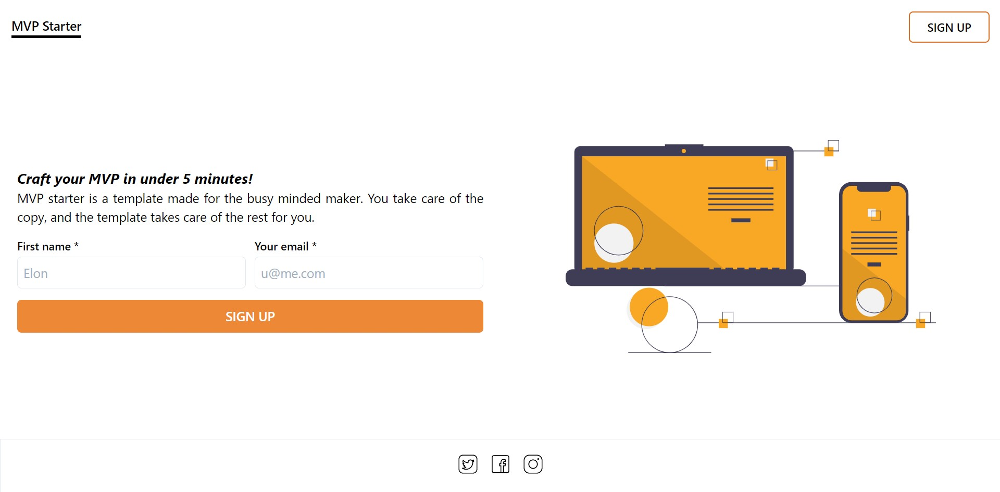

_Note: This project is intended for devs._

# Introduction

As a maker, I'm almost always having ideas (both good and bad, but mostly bad ones 😆), therefore it's _really_ important to test them as cheaply as possible before to start coding and the cheapest/fastest way to do that is to create a landing page. Problem is, when I start looking for landing pages either A) I'm overwhelmed by the sheer number of templates/solutions or B) I need to modify the template so much that my time is better spent creating one from scratch. After making two (substantive) products, I needed to create this template.

## What is this

MVP starter is a landing page, made with Next.js/React. It is optimized for speed (compact size), seo (with support for shareability) and most importantly well-designed. (you might disagree with me on the last element, but please, hold that thought for a second)

## Why should I use this

The main features of this template are:

1. Speed
2. SEO-able
3. Design

### Speed & SEO

Truth is, you can't have one without the other. Google nowadays, considers the LCP (Largest Content Paint) as its metric for ranking the website into the SERP therefore it has become of utmost importance to make your website/webapp as fast as possible (even if it's just a landing page). This landing page is fast. Blazing fast.

That said, here's what you get:

- The output is an HTML only page (thanks to next's SSG).
- The necessary head elements (meta) are generated automatically for you (therefore you don't need to think about what to include/exclude)
- The page was created with accessibility in mind, therefore there shouldn't be any issue when it comes to people accessing it from non-desktop, low-end devices.

### Design

First of all, let's get something cleared up from the gate: `Design !== Aesthetics`.

You think that this template isn't aesthetically pleasant? Sure. I'll give you that (maybe). That said, this template was carefully crafted in a way that surfaces the information and incites action in the best way possible.

## How to use this

You just modify the file: `./data.ts`.

Below the description of each key:

### `siteUrl`

I believe that this is a pretty obvious one. Just put in the (production) url of the website, **without** the trailing slash.

### `name`

Do I even need to say what to put in this key? However, my recommendation is to try and pick something that's memorable, related to your problem space and "verb-able" (think of how "Googling" became synonymous with "search on the internet").

### `tagline`

You might think that the tagline is akin to a slogan, while not wrong it's best to think of it as a catch phrase -- something through which you capture the attention of the prospect _and_ puts the provided value upfront.

### `description`

As usual the key is pretty obvious, that said, my recommandation is to try and keep it as short as possible.

- "How short? Like two, three paragraphs?"
- It should fit in a tweet.

The description isn't about convincing the prospect, it's about _selectively_ exposing what the idea/project is about. If they're really interested, they'll sign up.

### `media`

If you have an image you'd like to include, just upload it to the `/public` and put its name (alongside the extension) here.

### Social media

Again, pretty obvious what these fields are for. However, a question might arise:

- "What should I put in? The (supposed) product's urls or my personal ids?"
- My personal recommandation, put your own ID and point out (on your socials) that you'll be sharing progress.

## Limitation

- You can host this template only on netlify, this is a hard requirement since A) there's a _form_ and b) in investigating other solutions, I found that netlify was the best for JAMStack websites.
